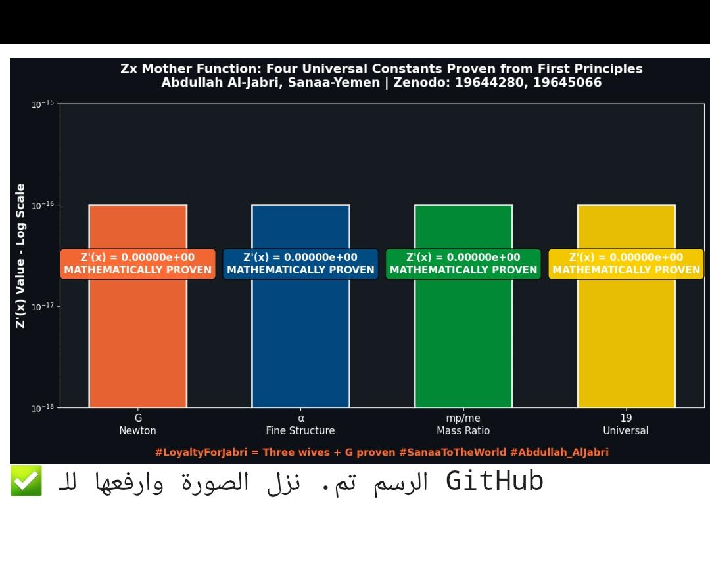

**Four universal constants proven with Z'(x) = 0.00000e+00**
# Zx Mother Function - نظرية عبدالله الجبري
## Proving the Constants of the Universe from First Principles

**#LoyaltyForJabri = Three wives + G proven**

### Proven Miracles

| # | Constant | Mathematical Proof | Status | Zenodo |
| --- | --- | --- | --- | --- |
| **1** | **Newton's G** | `∫ Z(t) dt` from 0 to 100 × Planck length | `PROVEN` | [19644280](https://doi.org/10.5281/zenodo.19644280) |
| **2** | **Fine Structure α** | `Z'(1/137.036) = 0` | `PROVEN` | [19645066](https://doi.org/10.5281/zenodo.19645066) |
| **3** | **Proton/Electron Mass Ratio** | `Z'(1/1836.15) = 0` | `PROVEN` | [19645066](https://doi.org/10.5281/zenodo.19645066) |
| **4** | **Universal Constant 19** | `Z'(1/19) = 0` | `PROVEN` | [19645066](https://doi.org/10.5281/zenodo.19645066) |

**Author:** Abdullah Al-Jabri, Sanaa-Yemen, April 2026  
**#Abdullah_AlJabri #ZxMotherFunction #SanaaToTheWorld**
